# Primary Goal

### Launching and registering the services `accounts (2222)` and `web`

#### First of all, we should launch Service discovery (`registration` written in Kotlin):
  ```
  ./gradlew :registration:bootRun
  ```
  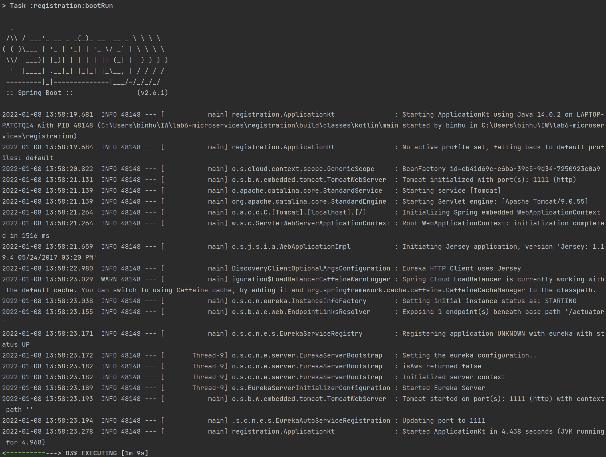

#### Lauching Account service (`accounts` written in Kotlin):
  ```
  ./gradlew :accounts:bootRun
  ```
  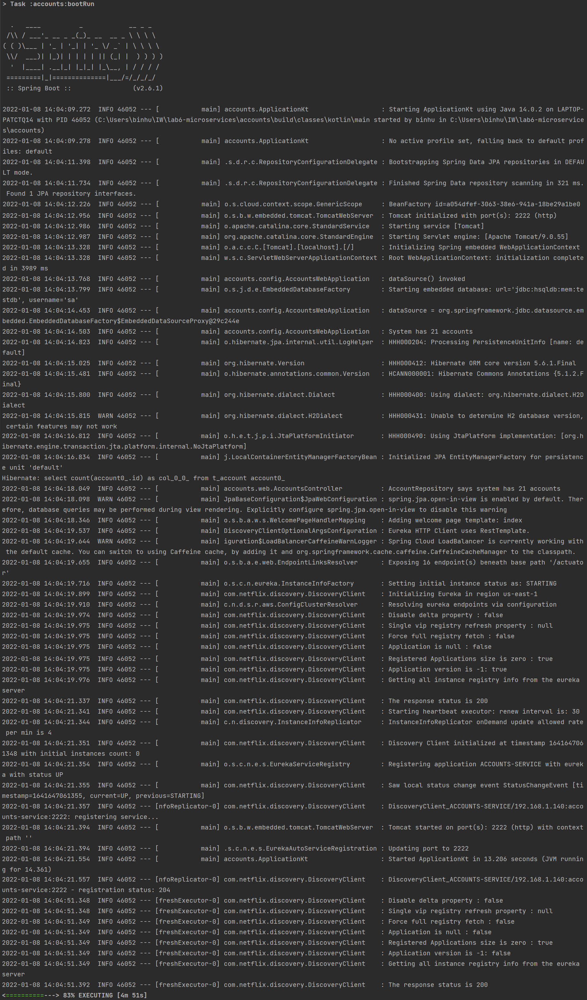

#### Launching Web service (`web` written in Java):
  ```
  ./gradlew :web:bootRun
  ```
  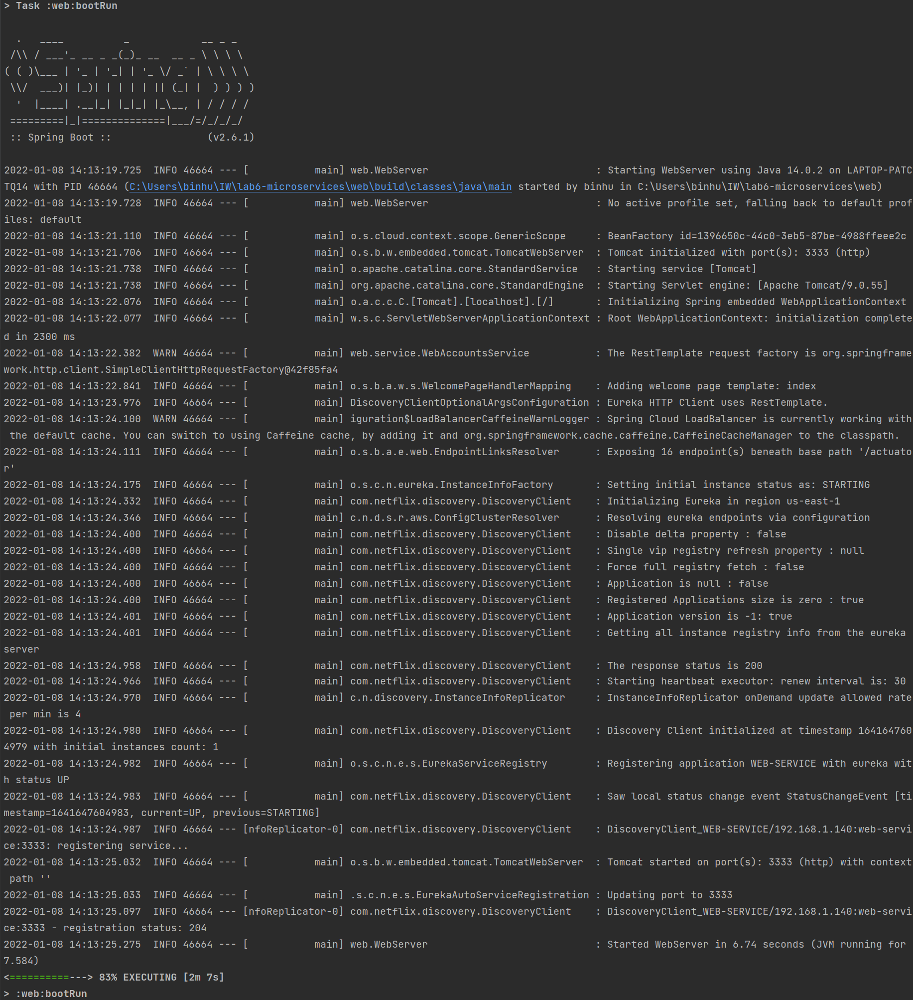

#### We can see that both services are registered in Eureka server, accessing its dashboard at `http://localhost:1111`:

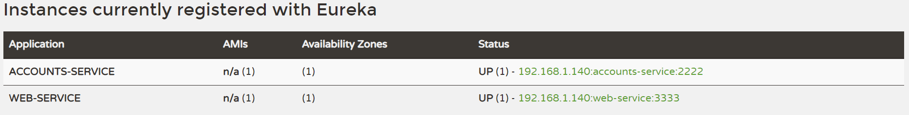

### Launching and registering `accounts (4444)`
#### In order to run a second `accounts` service instance using the port 4444, we should modify the `server.port` property in `accounts/src/main/resources/application.yml`:
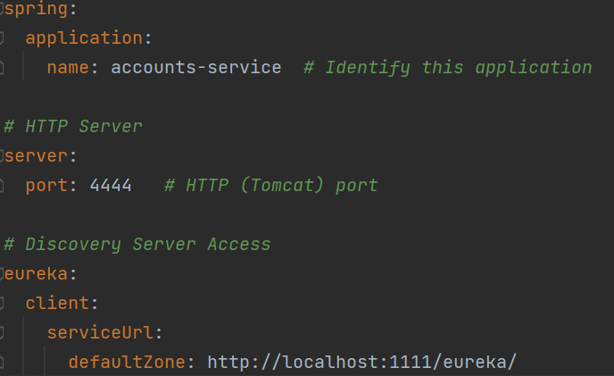

#### Then, we can run the second instance:
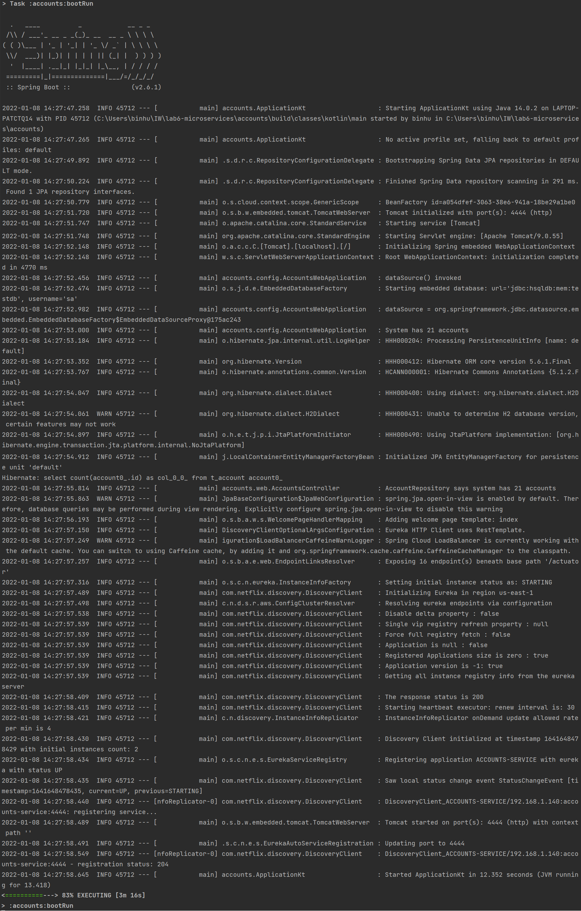

#### We can see two `accounts-service` services registered by Eureka server:
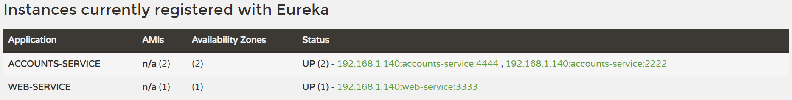

### Killing `accounts(2222)`
#### The two services were registered with the name `ACCOUNTS-SERVICE`, so the requests are distributed between both services. 
#### After killing the service `account (2222)`, for a moment some requests will still be redirected to `accounts (2222)` and we will get an `Internal Server Error`:
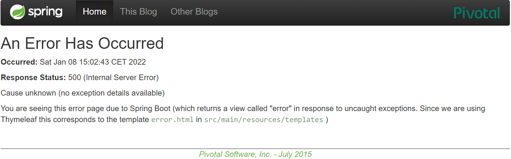

#### When the registration server discovers that this service is not available, it will stop serving it: 
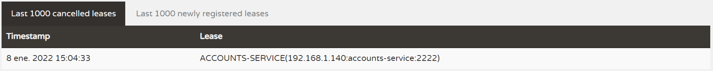

#### And it will only service `account (4444)` :
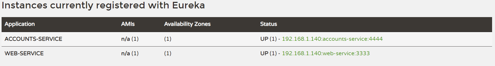

#### Then we can get correctly the information about the accounts:
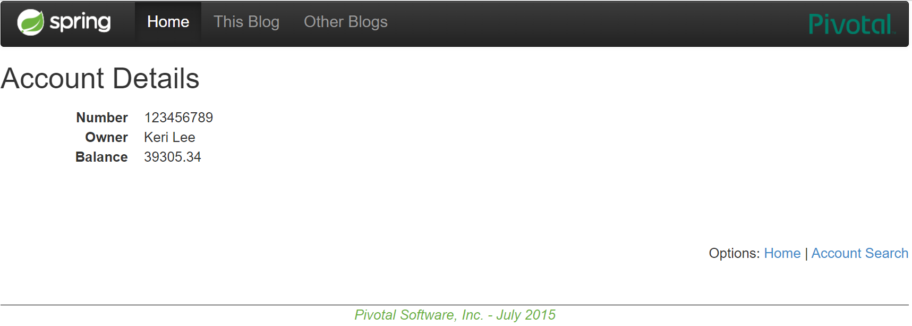

